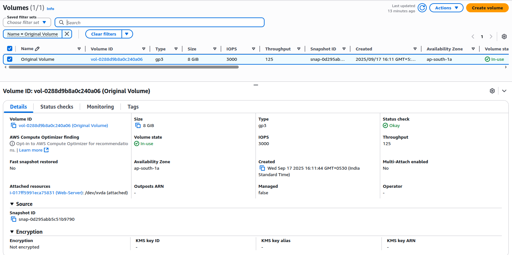
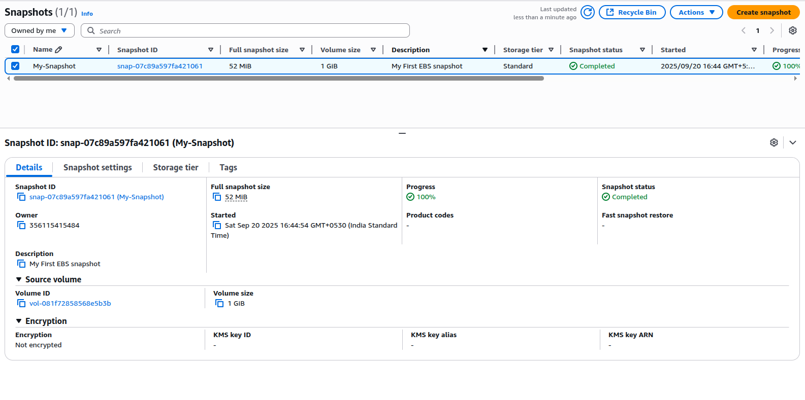
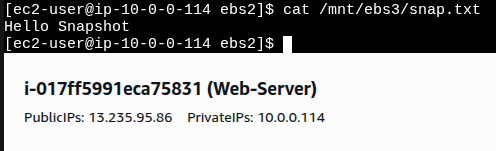

# Project 14: Create Snapshot of EBS Volume

## Objective
Learn how to create a snapshot of an EBS volume and restore it by creating a new volume from the snapshot.

---

## Steps
1. Launch an EC2 instance with an additional EBS volume (e.g., 1 GB).
2. Mount the EBS volume and create a test file.
   ```bash
   echo "Hello Snapshot" > /mnt/ebs2/snap.txt
3. From the AWS Console, go to Elastic Block Store → Volumes.
4. Select the volume → Actions → Create Snapshot.
5. Verify the snapshot in the Snapshots section.
6. Create a new volume from the snapshot.
7. Attach the new volume to the same or another EC2 instance.
8. Mount it and verify the file exists:
   ```bash 
   cat /mnt/ebs3/snap.txt

---

## Screenshots
- Original EBS volume attached



- Snapshot created



- New volume from snapshot


- File verified on restored volume



---

## Key Learnings
- Snapshots provide point-in-time backup of EBS volumes
- Snapshots are stored in Amazon S3 (internally managed by AWS)
- You can restore data by creating new volumes from snapshots


